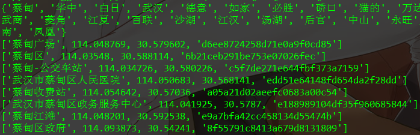

## 使用百度地图API获取城市地点的经纬度

### 文件介绍

* location.py 生成result.csv文件，并初始化固定地点
* suggestion.py 根据已有的地点，迭代添加推荐打车地点
* result.csv 执行结果全部保存为csv文件

建议执行方式:

* `windows: run.bat`
* `linux: sh run.sh`

执行结果:

### 文件下载

[原始数据百度网盘](https://pan.baidu.com/s/1WkWxGXi_nZxi7WS56Aenhw)