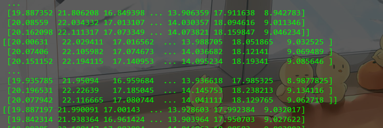
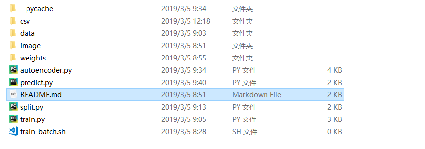

## 使用神经网络预测数据

问题: 根据城市各个地点，各个时刻的过往乘车人数数据预测相同地点的下一个相同时刻的乘车人数     

选择神经网络预测的原因:  

* 神经网络能够充分逼近复杂的非线性映射，能够学习与适应不确定系统的动态特性
* 所有定量或定性的信息都等势分布贮存于网络内的各神经元，具有较强的鲁棒性及容错性
* 进行大区域的订单量预测时，由于整个系统运作高度未知，映射关系极其复杂，且存在大量的历史数据。结合这些方面神经网络很好的符合这些特性

解决思路：

* 固定地点信息，对每一个地点，以不同的时间段作为输入，预测数量作为输出，训练一个单独的**自动编码器**
* 数据迭代存储和周期性训练 

预测数据截图

[训练数据，各个地点的训练参数，预测数据验证 网盘链接](https://pan.baidu.com/s/18qgLIuDR4M_06vf3XYRZjg )
提取码：7ddy   
**注意解压**  

目录结构截图

## Using neural networks to predict data

Question: According to the city's various locations, the number of passengers at each moment predicts the number of passengers at the same time in the same place.    

Reasons for choosing neural network predictions:  

* Neural networks can fully approximate complex nonlinear mappings, and can learn and adapt to the dynamic characteristics of uncertain systems.  
* All quantitative or qualitative information is equipotentially distributed to each neuron stored in the network, with strong robustness and fault tolerance.
* When forecasting the order quantity of a large area, the mapping relationship is extremely complicated due to the high degree of operation of the entire system, and there is a large amount of historical data. Combining these aspects, neural networks are well suited to these characteristics.  

Solutions:  

* Fixed location information, for each location, with different time periods as input, predicting quantity as output, training a separate neural network  
* Data iterative storage and periodic training

