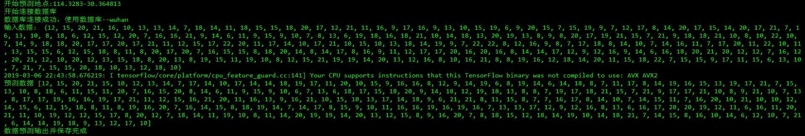

# 单服务器部署思路

## 服务器结构

### 数据库结构

* 单个地点形成一个表，初始数据为10000条，由csv文件转换
* 每一个表格式为 288列，10000+行
* 3600个地点对应3600个表,因为表的交互操作和相互无逻辑，可以保证效率

### 预测脚本

* 每一天0:00 后开始对每一个地点使用已经训练好的网络进行预测，并将结果添加到对应的表中，预测时间预估为三个小时(3600*3),视服务器性能,笔记本预测网络三秒
* 预测脚本调用服务器操作脚本

### 数据库操作脚本

* 构造类提供数据库操作接口
* 考虑到司机反馈信息(后期加入),脚本需要书写修改某个地点一列全部数据，重新训练网络，修改系统的预测值

### 逻辑脚本

* 使用一个总的shell脚本统领两个脚本的操作逻辑和提供定时操作

**后期需要考虑map-reduce技术和hadoop框架**  

使用数据库数据训练和预测结果对比:  



## 文件介绍

* autoencoder.py  自动编码器网络
* mysql_process.py  操作数据库代码，包括自动更新app的数据库和神经网络的数据库
* predict.py  使用神经网络预测数据
* train.py  训练每一个地点的自动编码器
* Process.py  进度条模型
* result.csv  武汉地点数据，此处三条为示例，[完整版](https://github.com/anner-wang/Easy-to-travel/blob/master/create_data/result.csv)  此文件直接决定系统的数据大小
* test_bactch.sh  批量预测脚本
* train_batch.sh  批量训练脚本
* update.sh  app对应的数据库数据定时更新脚本

## 如何使用

首先创建对应的数据库结构

database : wuhan

```
python mysql_process.py --csv2table y
```

开始将data中的csv文件存储在数据库中（时间很长......），这些都是系统的初始化,进入wuhan后，开始自己创建表

```
sh train_batch
```

开始批量化训练，保存模型参数到weights（自动创建）

```
sh test_bacth.py
```

开始预测，输出数据对比（截图来源），同时保存到数据库，作为后面的训练数据

```
sh update.sh
```

app数据五分钟更新最新数据，每天开启一次，放入逻辑脚本即可

